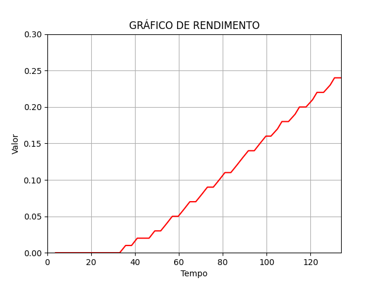
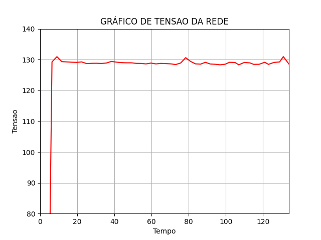
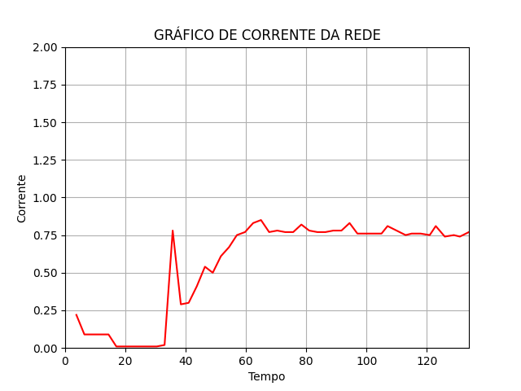

# ⚡ Smart Energy Meter

Monitor inteligente de energia elétrica com Arduino e Python. Mede tensão, corrente e potência em tempo real, armazena os dados em banco SQLite e gera relatórios visuais em PDF.

## 📸 Exemplos de Saída

| Custo Energético | Tensão da Rede | Corrente da Rede |
|:---:|:---:|:---:|
|  |  |  |

## 🏗️ Arquitetura

```
Arduino (sensores) → Serial USB → Python (coleta + banco) → Gráficos + PDF
```

### Componentes de Hardware
- Arduino Uno/Nano
- Sensor de corrente SCT013-030
- Transformador de tensão (ZMPT101B ou similar)
- Display LCD I2C 16x2

### Software
- **Arduino**: Leitura dos sensores e envio via serial
- **Python**: Coleta de dados, armazenamento, geração de gráficos e relatório PDF

## � Estrutura do Projeto

```
Smart-Energy-Meter/
├── arduino/
│   └── smart_energy_meter.ino   # Firmware do Arduino
├── src/
│   ├── __init__.py
│   ├── serial_reader.py         # Leitura da porta serial
│   ├── charts.py                # Geração de gráficos
│   └── pdf_report.py            # Exportação em PDF
├── data/                        # Banco de dados SQLite (gerado)
├── output/                      # Gráficos e PDF (gerados)
├── imagens/                     # Imagens de exemplo
├── main.py                      # Ponto de entrada principal
├── requirements.txt             # Dependências Python
└── README.md
```

## � Como Usar

### Pré-requisitos

- Python 3.8+
- Arduino IDE (para upload do firmware)
- Cabo USB para comunicação serial

### Instalação

1. Clone o repositório:
```bash
git clone https://github.com/IsaacMartins12/Smart-Energy-Meter.git
cd Smart-Energy-Meter
```

2. Crie e ative um ambiente virtual:
```bash
python -m venv venv

# Linux/Mac
source venv/bin/activate

# Windows
venv\Scripts\activate
```

3. Instale as dependências:
```bash
pip install -r requirements.txt
```

4. Faça upload do firmware para o Arduino:
   - Abra `arduino/smart_energy_meter.ino` na Arduino IDE
   - Ajuste o `VOLT_CAL` com um multímetro como referência
   - Faça upload para a placa

### Execução

```bash
# Execução completa (leitura serial + gráficos + PDF)
python main.py

# Especificar porta e número de leituras
python main.py --port COM5 --readings 100

# Gerar gráficos a partir de dados já existentes no banco
python main.py --skip-serial
```

### Opções da Linha de Comando

| Argumento | Padrão | Descrição |
|-----------|--------|-----------|
| `--port` | COM3 | Porta serial do Arduino |
| `--baudrate` | 9600 | Taxa de transmissão |
| `--readings` | 50 | Número de leituras |
| `--skip-serial` | - | Pula leitura e usa dados existentes |

## 🛠️ Tecnologias

- **Python 3** — Processamento de dados e geração de relatórios
- **SQLite** — Armazenamento local dos dados
- **Matplotlib** — Geração de gráficos
- **Pillow** — Montagem do PDF
- **PySerial** — Comunicação com Arduino
- **C/C++ (Arduino)** — Firmware de leitura dos sensores
- **EmonLib** — Biblioteca de monitoramento de energia (OpenEnergyMonitor)

## 📝 Protocolo Serial

O Arduino envia dados via serial no formato:

```
potencia|tensao|corrente|valor_acumulado|tempo_segundos
```

Exemplo: `45.2|127.3|0.355|0.0012|15.5`

## 📜 Licença

Este projeto está licenciado sob a [MIT License](LICENSE).
